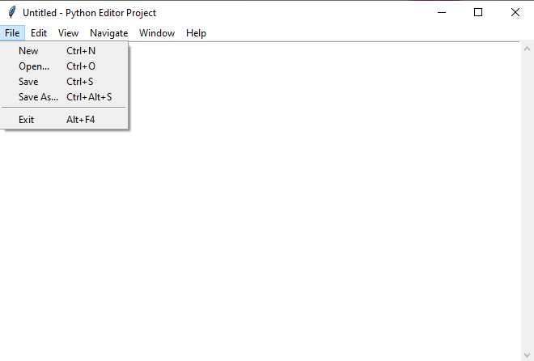

# Notepad-using-python3

 This is the clone of the Notepad Application where we can edit the text document, open and save it.
 
 ### Implementation
 ****
 - Implemented using the Python using the Idle python 3 editor.
 
 ### Appication user interface
 ****
 - Main layout
 
 
 
 - Help
 
 
 
 ### Running the appliacation
 ****
 - Use the Idle editor to run (or)
 - Use command line to run
 ```
    `python3 filename.py
```
Thank you...

